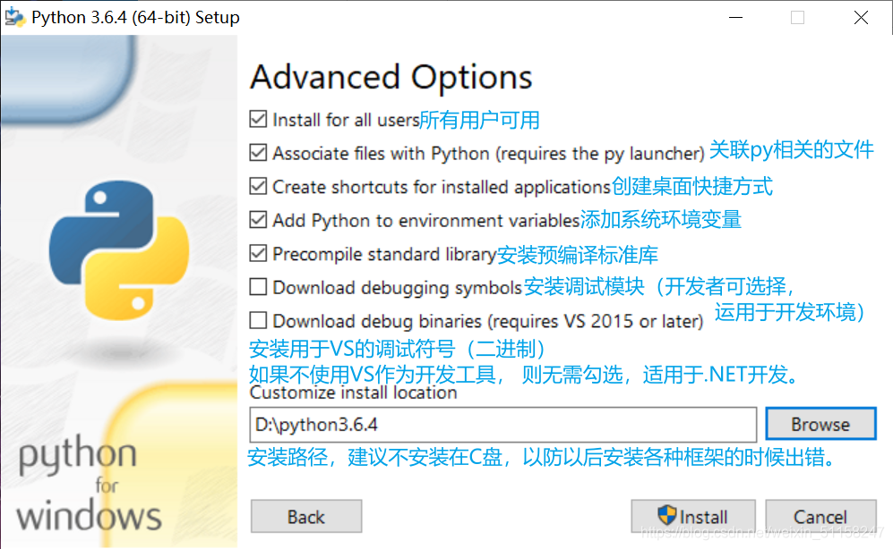

# Python快速上手

## 0.说明

本文档面向0基础的编程新手。通过学习本文档，可以达到懂一点编程的原理、会编写基本的Python程序、能够用Python建立项目。至于后续Python在机器学习、数据分析、人工智能、网络爬虫等方面的应用，是不在本文档的说明范围之内的，到了这个水平也不再属于快速上手的范畴。

## 1.有关编程和Python

### 1.1 我们是如何让机器读懂程序的

电子计算机是靠着“通电”“断电”两个状态表示0和1，而我们平时使用的程序（其实Windows等系统也算一个程序）都是在不断调用、读取、修改0和1状态，从而达到完成某个指令（如编写了一个Word文档）的目的。这个指令是在一个程序中运行的，程序是依靠代码运转，而代码是一层层的封装，最终调用0和1的不同状态。要知道的是，计算机只能读取“0”和“1”，所以我们看起来很简单的计算在0和1的世界里是这样的：

```python
0010 0001 0000 0100
0001 0001 0000 0101
0011 0001 0000 0110
0111 0000 0000 0001
```

然而我们并不需要靠0和1来编写程序，实际上，在计算机几十年的开发过程中，已经有人将这个**编译器和解释器**的工作做完了，我们编写代码调用这些编译器和解释器，编译器和解释器再将它们翻译成为0和1。（实际上现在的编程语言已经高级很多了，有很多层的编译器和解释器，一层一层调用）

> 编译器：高级语言（我们看得懂）→机器语言（电脑看得懂），只有翻译的过程。输入的是高级语言，经过编译器，得到的是机器语言，最终的程序是以机器语言存储的，直接打开代码出现的是机器语言。
>
> 解释器：高级语言→机器语言，不仅可以翻译，还能执行。对程序中的每个命令都执行这个操作：翻译、执行。输入的是高级语言，经过解释器翻译，再执行命令，最终程序是以高级语言存储的，只不过每次执行的时候都需要先翻译成机器语言，再执行。

**算法**是编程中非常重要的思想，或者说算法决定了一个程序的步骤，**是指令/命令的有限序列**，它一定是有一个结果的（不会永远执行）。算法需要有这几个属性：**输入**、**输出**、**有限**、**确定**（算法内所有的步骤都是被精确定义的）、**有效**（是可行的，且计算不需要太多的时间）。创建一个算法通常需要三个步骤：输入、处理、输出，可能存在不需要输入阶段的情况，这种情况下，电脑/机器知道自己要做什么事情（比如编写一个程序计算1-10的自然数的和，机器明确知道自己的任务）。

### 1.2 有关Python

介绍放这里了：[百度百科](https://baike.baidu.com/item/Python/407313?fr=aladdin)，[Python官方](https://www.python.org/)

Python有多种解释器，比较著名的有CPython、IPython、PyPy、Jython和IronPython等。

- CPython是Python官方默认的解释器，它是用C语言实现Pyhon解释器。CPython是单纯的解释器，将源代码转化为字节码之后解释执行。

- PyPy，比CPython解释器更加灵活。在程序的运行性能上PyPy将近是CPython解释器执行效率的1至5倍。

- IPython是基于CPython增强了交互。

- Jython是运行在Java平台上的Python解释器。

- IronPython是运行在.Net平台上的Python解释器。

- pycharm可以说是标准的python开发环境，功能最全，唯一的缺点就是启动有点慢。

Python发展了很多年，拥有了很多拓展包。拓展包的功能很丰富，而且集成度相对比较高，也就是说，某一类功能可以通过调用拓展包来实现（所谓的“调包师”），这个在后续会详细讲。

先从下载安装Python和搭建Python环境开始。

首先，[在这里下载Python安装包](https://www.python.org/downloads/)，由于一些奇怪的原因，有一些拓展包不支持最新版的Python，以及最新版的Python有时候会出现不稳定等情况，建议安装3.8.1版本的Python。（上面的链接服务器不在国内，网速可能比较慢，因此推荐使用[国内镜像网站下载](http://npm.taobao.org/mirrors/python/)）

安装Python时，不建议安装目录出现中文字符（可能会出现不稳定的问题）。具体如下（[图源链接](https://blog.csdn.net/weixin_51158247/article/details/111306867)）：




之后就安装完成了，并且通常情况下，已经将Python添加到系统变量中去了（意思是系统已经承认Python是个编程系统了），检测方法是Win+R打开运行窗口，输入cmd并执行（如下图）


在打开的窗口中输入python，如下图：


如果出现如下的内容，说明已经启动了Python，也就是成功安装了Python并完成了系统环境搭建，恭喜你！[如果没出现请看这里](https://blog.csdn.net/weixin_51158247/article/details/111306867)


如果用上面的开发环境，可能会劝退大多数人，所以接下来我们需要一个很屌的开发环境，或者说一个集成了写代码、运行调试代码的平台——Visual Studio Code.（参见VS Code快速上手.md）


## 2.教机器“认字”和“说话”

编程过程中最基础的就是交互，编写的程序作为输入，执行过程作为处理，得到的结果显示或输出的文件作为输出，这一节将介绍基础的交互、基本的变量类型和基本的Python命令。

请记住，**Python文件是 .py 结尾的**。

### 2.0 Python认识什么字

所有用Python处理的东西，都是用数字或字符表示的。通常称它们为**变量**（这里不展开讲变量储存的原理，暂时没有了解的必要），Python的变量一共有五种类型：数字（number）、字符串（string）、列表（list）、元组（tuple）、字典（dictionary）。这里先介绍最常用的数字和字符串，后续的部分遇到了再展开说明。

直接看例子：

```python
#这里是数字的类型
x = 3				#定义了一个变量x，它的值为3，是个整型变量
print(type(x))		#用type(?)命令查看变量?的类型，并用print命令输出
y = 3.14			#定义了一个变量y，它的值为3.14，是个浮点型变量
print(type(y))
y1 = 3.14e5			#定义了一个变量y1，它的值是3.14×10^5，也用浮点型变量表示
y2 = 3.14e-5		#定义了一个变量y2，它的值是3.14×10^-5，也用浮点型变量表示
print(y1, y2)
z = complex(3,14)	#定义了一个变量z，是个复数型变量，实部是3，虚部是14
print(type(z))
del x				#del函数删除掉了x的所代表的值，这时候再用print命令输出会报错

```

```python
#这里是字符串类型
a = 'Hey Jude,'				#单引号和双引号作用相同，引号内部的内容都是字符串a所代表的，相当于给这一串字符起了个名字叫a
b = "don't be afraid."
c = '''Take a sad song
then go to get her.
Remember to let her in to your hear.
Then you can start to make it better.
'''
#三个单引号所括起来的内容可以在其中任意换行而不会中断，也可以在三个单引号内使用单引号或者双引号，作为引号的引号
print(a,b)
print(c)
```

值得注意的是，和变量相对的是**常量**，常量在被定义/声明之后是不会改变的，可惜，**Python中是没有常量的**。如果我们需要在Python中使用常量的话，可以定义一个变量，只要不改变变量的值，就可以视它为常量。

> 声明一个变量：声明一个变量会占用内存（RAM）的一部分空间，相当于给变量留个位置，声明的作用是使得编译器和解释器可以知道一个变量需要多大的空间。


### 2.1 熟悉的“Hello World!”——print命令

代码举例：

```python
print("Hello Wrold!")
#上面的语句就是标准的输出字符串，或者说双引号中的内容就是输出显示的内容
#通常会用注释符号 井号 来解释代码的作用，这也是编程的一个好习惯，编程时用注释将代码的意义写清楚，一方面可以在寻找程序bug时提供便利，另一方面可以方便下次查看了解代码的含义或逻辑
```

print函数是作为输出最常见的一种方式，代码运行的结果会直接显示在终端中作为输出。之后会介绍作为文件存储的输出方式。

来看下面的代码例子：

```python
print("Good","to","see","you.")					#如果不定义分隔符，Python会自动添加空格
print("Good", "to", "see", "you.",sep = "*")		#通过sep命令可以自定义分隔符
print("Good", "to", "see", "you.",sep = "")

a = 'Good to see you'
print(a)			#可以直接输出a所代表的内容
a = 3
print(a)

#具有特殊作用的格式化输出符号
print("Good","\t","to","\t","see","\t","you.")	#\t 表示间隔一个制表位（相当于点按一次Tab键）输出，可以对齐，强迫症福音
print("Good","\n","to","\n","see","\n","you.")	#\n 表示换行输出

```

