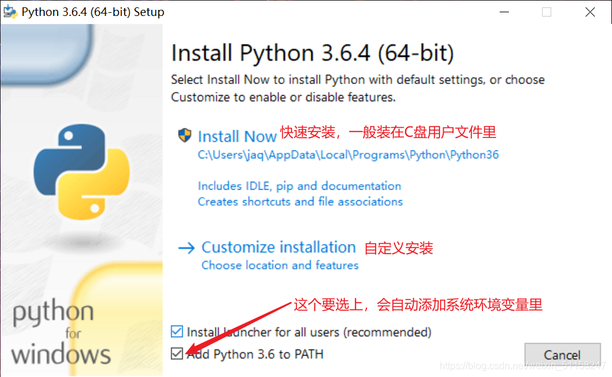
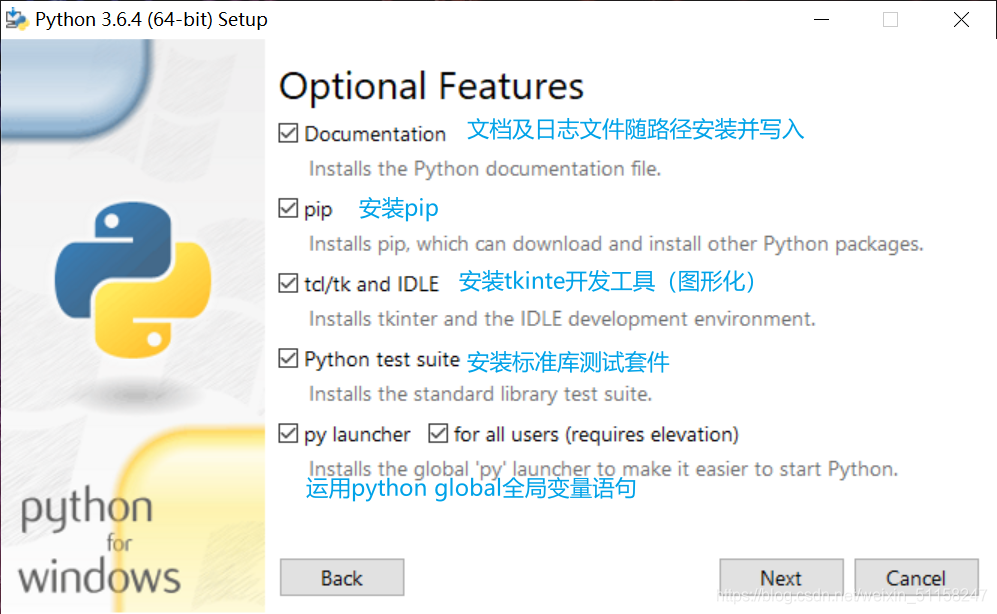
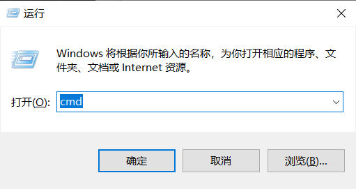
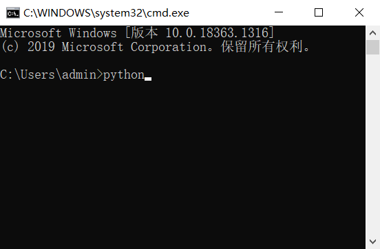
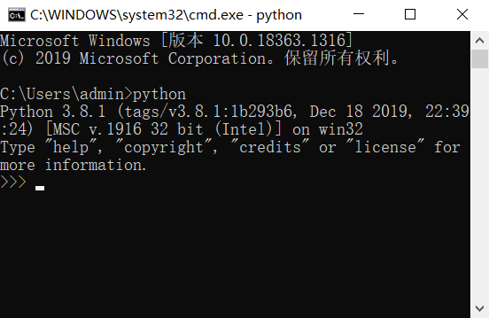

# Python入门

## 0.说明

​	本文档面向0基础的编程新手。通过学习本文档，可以达到懂一点编程的原理、会编写基本的Python程序、能够用Python建立项目。至于后续Python在机器学习、数据分析、人工智能、网络爬虫等方面的应用，是不在本文档的说明范围之内的，到了这个水平也不再属于快速上手的范畴。

## 1.有关编程和Python

### 1.1  我们是如何让机器读懂程序的

​	电子计算机是靠着“通电”“断电”两个状态表示0和1，而我们平时使用的程序（其实Windows等系统也算一个程序）都是在不断调用、读取、修改0和1状态，从而达到完成某个指令（如编写了一个Word文档）的目的。这个指令是在一个程序中运行的，程序是依靠代码运转，而代码是一层层的封装，最终调用0和1的不同状态。要知道的是，计算机只能读取“0”和“1”，所以我们看起来很简单的计算在0和1的世界里是这样的：

```python
0010 0001 0000 0100
0001 0001 0000 0101
0011 0001 0000 0110
0111 0000 0000 0001
```

​	然而我们并不需要靠0和1来编写程序，实际上，在计算机几十年的开发过程中，已经有人将这个**编译器和解释器**的工作做完了，我们编写代码调用这些编译器和解释器，编译器和解释器再将它们翻译成为0和1。（实际上现在的编程语言已经高级很多了，有很多层的编译器和解释器，一层一层调用）

> 编译器：高级语言（我们看得懂）→机器语言（电脑看得懂），只有翻译的过程。输入的是高级语言，经过编译器，得到的是机器语言，最终的程序是以机器语言存储的，直接打开代码出现的是机器语言。
>
> 解释器：高级语言→机器语言，不仅可以翻译，还能执行。对程序中的每个命令都执行这个操作：翻译、执行。输入的是高级语言，经过解释器翻译，再执行命令，最终程序是以高级语言存储的，只不过每次执行的时候都需要先翻译成机器语言，再执行。

​	**算法**是编程中非常重要的思想，或者说算法决定了一个程序的步骤，**是指令/命令的有限序列**，它一定是有一个结果的（不会永远执行）。算法需要有这几个属性：**输入**、**输出**、**有限**、**确定**（算法内所有的步骤都是被精确定义的）、**有效**（是可行的，且计算不需要太多的时间）。创建一个算法通常需要三个步骤：输入、处理、输出，可能存在不需要输入阶段的情况，这种情况下，电脑/机器知道自己要做什么事情（比如编写一个程序计算1-10的自然数的和，机器明确知道自己的任务）。

### 1.2  有关Python

介绍放这里了：[百度百科](https://baike.baidu.com/item/Python/407313?fr=aladdin)，[Python官方](https://www.python.org/)

​	Python有多种解释器，比较著名的有CPython、IPython、PyPy、Jython和IronPython等。

- CPython是Python官方默认的解释器，它是用C语言实现Pyhon解释器。CPython是单纯的解释器，将源代码转化为字节码之后解释执行。

- PyPy，比CPython解释器更加灵活。在程序的运行性能上PyPy将近是CPython解释器执行效率的1至5倍。

- IPython是基于CPython增强了交互。

- Jython是运行在Java平台上的Python解释器。

- IronPython是运行在.Net平台上的Python解释器。

- pycharm可以说是标准的python开发环境，功能最全，唯一的缺点就是启动有点慢。

  Python发展了很多年，拥有了很多拓展包。拓展包的功能很丰富，而且集成度相对比较高，也就是说，某一类功能可以通过调用拓展包来实现（所谓的“调包师”），这个在后续会详细讲。

先从下载安装Python和搭建Python环境开始。

​	首先，[在这里下载Python安装包](https://www.python.org/downloads/)，由于一些奇怪的原因，有一些拓展包不支持最新版的Python，以及最新版的Python有时候会出现不稳定等情况，建议安装3.8.1版本的Python。（上面的链接服务器不在国内，网速可能比较慢，因此推荐使用[国内镜像网站下载](http://npm.taobao.org/mirrors/python/)）

​	安装Python时，不建议安装目录出现中文字符（可能会出现不稳定的问题）。具体如下（[图源链接](https://blog.csdn.net/weixin_51158247/article/details/111306867)）：






​	之后就安装完成了，并且通常情况下，已经将Python添加到系统变量中去了（意思是系统已经承认Python是个编程系统了），检测方法是Win+R打开运行窗口，输入cmd并执行（如下图）



在打开的窗口中输入python，如下图：



​	如果出现如下的内容，说明已经启动了Python，也就是成功安装了Python并完成了系统环境搭建，恭喜你！[如果没出现请看这里](https://blog.csdn.net/weixin_51158247/article/details/111306867)



​	如果用上面的开发环境，可能会劝退大多数人，所以接下来我们需要一个很屌的开发环境，或者说一个集成了写代码、运行调试代码的平台——Visual Studio Code.

#### 1.2.X  Visual Studio Code

[这是官网](https://code.visualstudio.com/)，只不过打开比较慢。

安装过程中以下几个选项建议勾选：


这样安装完成重启后，点击鼠标右键菜单，可以看到“通过Code打开”的选项：


这样可以在资源管理器/文件夹中点击，快速使用VS Code打开这个文件夹。

### 1.3  VS Code中的拓展插件安装

安装好VS Code后，在左侧的“拓展”菜单（Ctrl+Shift+X）中搜索如下几个拓展包：

- Chinese (Simplified) Language Pack For VS Code  →  不用说了，至少看得懂操作界面了（安装完后会提示重启，重启即可）
  
- Python  →  虽然已经安装了Python 3.8.1，但是不在VS Code中安装这个拓展包依然会导致无法编译等问题出现。
  
- Code Runner  →  这个拓展插件可以支持单击鼠标右键执行当前已经保存的代码，不需要再寻找执行键，比较方便，推荐使用。
  

此外VS Code在最开始几次运行的过程中，右下角会有弹出的窗口提示安装相关插件，安装即可。

> 这里建议修改默认字体的大小，打开左下角设置，在搜索设置中搜索 Font Size，主要需要修改的是两项，如下：
> 

### 1.4  Python环境搭建及项目创建

​	以下部分内容来自于[这里](https://blog.csdn.net/weixin_40528417/article/details/81141567?utm_medium=distribute.pc_relevant.none-task-blog-BlogCommendFromMachineLearnPai2-14.control&depth_1-utm_source=distribute.pc_relevant.none-task-blog-BlogCommendFromMachineLearnPai2-14.control)，如果有描述不清楚的内容建议查看。

​	首先，找一个稳定可靠的位置新建文件夹（不建议在文件路径中出现中文字符，有时候莫名其妙的问题可能会是中文字符造成的），之后进入文件夹右键选择“通过Code打开”，在左边资源管理器中选择新建文件：


​	新建文件之后，需要一并补充文件后缀名，新建Python文件的后缀是“.py”，这个文件就是一个没有内容的Python文件了。完成这个操作之后，需要对这个文件夹进行属于VS Code的环境配置，这个配置只对这个文件夹内的所有Python文件生效，只需要执行一次这样的操作（一劳永逸）。具体操作如下：

- 使用Ctrl+Shift+P打开搜索  →  输入“调试”或者“launch”  →  选择“Python文件”，会弹出名为launch.json的文件，修改成如下内容：
  **（注意：中间有pythonpath的位置，选择自己的Python安装的位置！）**

  ```python
  {
      // Use IntelliSense to learn about possible attributes.
      // Hover to view descriptions of existing attributes.
      // For more information, visit: https://go.microsoft.com/fwlink/?linkid=830387
      "version": "0.2.0",
      "configurations": [
          {
              "name": "Python",
              "type": "python",
              "request": "launch",
              "stopOnEntry": false,
              "pythonPath": "D:\\Install\\3.Tools\\Python 3.8.1\\python.exe",
              "program": "${file}",
              "cwd": "${workspaceFolder}",
              "console": "integratedTerminal"
          },
          {
              "name": "Python: Attach",
              "type": "python",
              "request": "attach",
              "port": 5678,
              "host": "localhost"
          },
          {
              "name": "Python: Module",
              "type": "python",
              "request": "launch",
              "stopOnEntry": false,
              "pythonPath": "D:\\Install\\3.Tools\\Python 3.8.1",
              "module": "enter-your-module-name-here",
              "console": "integratedTerminal"
          },
          {
              "name": "Python: Django",
              "type": "python",
              "request": "launch",
              "stopOnEntry": false,
              "pythonPath": "D:\\Install\\3.Tools\\Python 3.8.1",
              "program": "${workspaceFolder}/manage.py",
              "console": "integratedTerminal",
              "args": [
                  "runserver",
                  "--noreload",
                  "--nothreading"
              ],
              "django": true
          },
          {
              "name": "Python: Flask",
              "type": "python",
              "request": "launch",
              "stopOnEntry": false,
              "pythonPath": "D:\\Install\\3.Tools\\Python 3.8.1",
              "module": "flask",
              "env": {
                  "FLASK_APP": "app.py"
              },
              "args": [
                  "run",
                  "--no-debugger",
                  "--no-reload"
              ],
              "jinja": true
          },
          {
              "name": "Python: Current File (External Terminal)",
              "type": "python",
              "request": "launch",
              "stopOnEntry": false,
              "pythonPath": "D:\\Install\\3.Tools\\Python 3.8.1",
              "program": "${file}",
              "console": "externalTerminal"
          }
      ]
  }
  ```

- 使用Ctrl+Shift+P打开搜索  →  输入“tasks”，选择“配置任务”  →  选择“使用模板创建tasks.json文件”  →  将弹出的文件内容修改如下：

  ```python
  {
      "version": "2.0.0",
      "tasks": [
          {
              "label": "python3",
              "type": "shell",
              "command": "/usr/bin/python3",
              "args": ["${file}"]
          }
      ]
  }
  ```

- 完成以上两个步骤之后，在左侧的资源管理器中会出现新的文件，如下：
  

这样就完成了Python在VS Code中的配置。

## 2.教机器“认字”和“说话”

​	编程过程中最基础的就是交互，编写的程序作为输入，执行过程作为处理，得到的结果显示或输出的文件作为输出，这一节将介绍基础的交互、基本的变量类型和基本的Python命令。

​	请记住，**Python文件是 .py 结尾的**。

### 2.0  Python认识什么字

​	所有用Python处理的东西，都是用数字或字符表示的。通常称它们为**变量**（这里不展开讲变量储存的原理，暂时没有了解的必要），Python的变量一共有五种类型：数字（number）、字符串（string）、列表（list）、元组（tuple）、字典（dictionary）。这里先介绍最常用的数字和字符串，后续的部分遇到了再展开说明。

直接看例子：

```python
#这里是数字的类型
x = 3				#定义了一个变量x，它的值为3，是个整型变量
print(type(x))		#用type(?)命令查看变量?的类型，并用print命令输出
y = 3.14			#定义了一个变量y，它的值为3.14，是个浮点型变量
print(type(y))
y1 = 3.14e5			#定义了一个变量y1，它的值是3.14×10^5，也用浮点型变量表示
y2 = 3.14e-5		#定义了一个变量y2，它的值是3.14×10^-5，也用浮点型变量表示
print(y1, y2)
z = complex(3,14)	#定义了一个变量z，是个复数型变量，实部是3，虚部是14
print(type(z))
del x				#del函数删除掉了x的所代表的值，这时候再用print命令输出会报错

```

```python
#这里是字符串类型
a = 'Hey Jude,'				#单引号和双引号作用相同，引号内部的内容都是字符串a所代表的，相当于给这一串字符起了个名字叫a
b = "don't be afraid."
c = '''Take a sad song
then go to get her.
Remember to let her in to your hear.
Then you can start to make it better.
'''
#三个单引号所括起来的内容可以在其中任意换行而不会中断，也可以在三个单引号内使用单引号或者双引号，作为引号的引号
print(a,b)
print(c)
```

值得注意的是，和变量相对的是**常量**，常量在被定义/声明之后是不会改变的，可惜，**Python中是没有常量的**。如果我们需要在Python中使用常量的话，可以定义一个变量，只要不改变变量的值，就可以视它为常量。

> 声明一个变量：声明一个变量会占用内存（RAM）的一部分空间，相当于给变量留个位置，声明的作用是使得编译器和解释器可以知道一个变量需要多大的空间。


### 2.1  熟悉的“Hello World!”——print命令

代码举例：

```python
print("Hello Wrold!")
#上面的语句就是标准的输出字符串，或者说双引号中的内容就是输出显示的内容
#通常会用注释符号 井号 来解释代码的作用，这也是编程的一个好习惯，编程时用注释将代码的意义写清楚，一方面可以在寻找程序bug时提供便利，另一方面可以方便下次查看了解代码的含义或逻辑
```

print函数是作为输出最常见的一种方式，代码运行的结果会直接显示在终端中作为输出。之后会介绍作为文件存储的输出方式。

来看下面的代码例子：

```python
print("Good","to","see","you.")					#如果不定义分隔符，Python会自动添加空格
print("Good", "to", "see", "you.",sep = "*")		#通过sep命令可以自定义分隔符
print("Good", "to", "see", "you.",sep = "")

a = 'Good to see you'
print(a)			#print可以直接输出a所代表的内容
a = 3
print(a)

#具有特殊作用的格式化输出符号
print("Good","\t","to","\t","see","\t","you.")	#\t 表示间隔一个制表位（相当于点按一次Tab键）输出，可以对齐，强迫症福音
print("Good","\n","to","\n","see","\n","you.")	#\n 表示换行输出
```

### 2.2  比较和判断——布尔表达式/与或非

​	先说布尔表达式。**布尔表达式的结果是 true 或者 false.** 举例如下：

```python
#布尔表达式的格式是
#表达式1 比较运算符 表达式2
#表达式的形式可以是数字、变量，还有表达式
x >= 3		#表示x大于等于3吗？如果x确实大于等于三，则这个式子的结果就是true

#举个详细的例子
a = 2
b = 3			#给a和b分别赋值2和3
c = a >= b		#c是布尔表达式(a>=b)的值，即c只能是true或者false
print(c)		#输出c的结果

#其他的比较运算符
a == b				#a和b相等吗？相等，输出值/返回值就是true
a != b				#a和b不相等吗？不相等，输出值/返回值就是true
a > b; a < b		#a大于/小于b吗？
a >= b; a <= b		#a大于等于/小于等于b吗？
```

​	有了以上的表达关系，我们就可以进行更深更复杂的表达，也就是与、或、非的表达，此时至少需要有两个表达式。（与、或、非的判定结果不再赘述）

```python
#需要进行与、或、非的判定的布尔表达式结构还是一样的
#表达式1  逻辑运算符（与或非） 表达式2

#举个例子
a = 5
b = 8
c = (a > 2) and (b > a)		#只有a>2且b>a两个式子同时成立，c的值才为真
#这里的括号不是必要的，只是为了提高可读性

#或的表达：
c = (a > 2) or (b > a)		#a>2且b>a两个式子有一个成立，c的值就为真
#非的表达：
c = (a > 2) not (b > a)		#a>2且b>a两个式子都不成立，c的值才为真
```

​	有了以上两种表达，就可以写出如下复杂的表达了，这里关键的问题在于计算机处理这些运算的顺序，在Python中（大多数的编程语言也是这样），计算顺序的优先级如下：
$$
算数运算>比较和从属运算>逻辑运算
$$

> 算术运算中，最先计算的是乘幂(用\**表示)，然后是乘除运算，最后是加减，有括号先算括号。这里与我们的在数学上的认知是一致的。
>
> 比较运算在上文有提到过；从属运算在后面会有举例，简单来说就是某个元素在不在某个集合中，在就返回true.
>
> 逻辑运算的优先级最低，也就是最后运算。

```python
#长难句练习
a = 5, b = 2, c = 7, d = -3
(3*a + b/47 - c*b/a > 23) and (b != 2)
#求上面这个表达式是true还是false
```

​	这里补充一下从属运算，主要有两种具体的表达，举例如下：

```python
#in 表示某个元素在指定序列中吗，如果存在，则返回true
x = 6
y = x in [3,5,8,9]		#意思是，x在序列[3,5,8,9]中吗？如果在，y的值就是true
print(y)				#输出y的值，true或者false
#这里[3,5,8,9]是一个简单的列表表达方式，以后会对列表这样的变量类型详细介绍
#以上的表达式可以展开，用与或非关系改写
x = 6
y = (x == 3) or (x == 5) or (x == 8) or (x == 9)
#可以看到，用从属运算可以使得其他表达变得简单

#再举一个例子
a = 's' in 'science'		#意思是，s在不在字符串science中存在呢？如果在，那么a的值就是true
print(a)

#not in 这个表达与 in 的意思刚好相反，表示某个元素在指定序列中吗，如果不在，返回true
```

### 2.3  if/else结构

​	这是代码中最常见的一种结构，如果……就执行A命令，否则执行B命令，具体的格式如下：

```python
#格式举例
a = 1
if a >= 0:		#注意，这里一定要有冒号。在VS Code中输入冒号换行后会自动缩进
    x = 3
    print(a+x)
else:			#这里也必须有冒号
    x = 0
    print(a*x)
```

​	这里说明一点，有关Python中的缩进（即点按一次tab，相当于4个空格）。Python代码被戏称为“游标卡尺”，原因也在这里，如刚刚提及的if结构，在if内部的命令必须具有同样的缩进（这里是一个缩进），否则就不会被认为是if内的命令而报错；同样在else语句中也需要同样的缩进，否则也会报错。此外，在while和for循环中也需要相应的缩进。

​	在if结构中，我们可以多层嵌套，if里面套if；或者用elif命令（else if的简写）进行多个分支，比如下面的代码：

```python
#用电脑评判你的成绩
print("请输入你的成绩")
x = int(input())
#↑这里有两个命令，input()命令（实际上是个函数）用于读取一个合法的输入，并转化为string；而int()函数，是将括号内的内容转化为整型变量。这一句命令中使用了嵌套，把input()函数嵌套在了int()函数中，有点类似复合函数。
if x <= 60:
    print("你的成绩不及格")
elif 60 < x <= 80:
    print("你的成绩还凑合")
elif 80 < x <= 100:
    print("你的成绩不错嘛")
    if x == 100:
        print("学霸你太厉害啦")
else:
    print("你成绩是假的吧")
```

### 2.4  循环结构

#### 2.4.1  while循环——当型循环

​	这类循环的含义是：当满足/不满足某个条件时，执行某个命令，是先进行判断，再执行命令的循环结构。它的一般结构如下：

```python
i = 1				#定义了一个计数器i，每一次循环，i的数值会变化，可以用来设定循环次数
while i <= 10:		#当 i ≤ 10 的时候，都执行while内部的命令，注意，这里需要有冒号
    print(i)
    i += 1			#是一种简略写法，含义是 i = i + 1，即新的i比旧的i增加了1，类似的可以将"+"替换成加减乘除中的任意一种
#注意缩进，同样的缩进都被认为是在同一个while循环中，不在循环中的命令不要缩进
```

```python
#如果需要跳出循环，可以使用break命令，如下
#假设我们需要计算多少的阶乘刚刚大于10000，此时我们不知道需要循环多少次，但是知道有一个条件“x的阶乘大于10000”，只要满足这个条件就不用再循环了
x = 1		#设x是需要求的数字
y = 1		#设y是x的阶乘
j = 1		#设定一个计数器
while j<100000:			#因为不知道要循环多少次，所以设定一个较大的数
    y = y * (x + 1)
    x += 1				#每次都使得x的值比上一次大1
    j += 1
    if y >= 10000: break		#使用break跳出循环
print(x)

#以上例子还可以用while直接判定，即只要阶乘的值大于10000即可，修改如下：
x = 1		#设x是需要求的数字
y = 1		#设y是x的阶乘
while y <= 10000:		#判定条件是：只要y>10000，即结束循环
    y = y * (x + 1)		
    x += 1
print(x)
#计算结果是同样的
```

#### 2.4.2  for循环——直到型循环

​	这类循环的含义是：一直执行某个命令，直到达到某个条件才结束循环，是先执行命令，再进行判定的循环结构，与当型循环刚好相反。在Python中，for循环用的更多，可读性更强。它的一般结构如下：

```python
for var in sequence:
	Statements
#var是一个变量，依次给它赋予序列sequence中的值，每次赋予值后都执行Statements中的命令。直到所有的sequence中的值都被赋予完了，停止循环。
```

​	这里需要注意的一点是，**对于for循环，var的值不建议在循环中改变**。因为var的值是被sequence中的赋值而改变的，从而实现了循环。如果一定要改变var的值，建议使用while循环。不过，var的值还是可以出现在循环内部（只是不建议改变它）。

​	for循环的用法在Python中比较多，举例如下：

```python
for letter in "hello":
    print(letter)
#这个命令可以逐一输出hello中的字母，每一次只输出一个字母

for i in [1,2,3,4,5]:
    print(i)
#这个命令可以逐一输出序列[1,2,3,4,5]中的数字
```

​	每次都定义一个序列非常麻烦，这里介绍一个经常配合for循环的函数：range函数

```python
range([初值,]终值[,步长])
#[]里面的内容是可以省略的，如果不需要或者没有要求可以不用输入
#所有的值都必须是整型！

range(5)
#省略了初值和步长，只有终值。如果省略，那么初值的默认值是0，步长的默认值是1
for i in range(5):		#意思是i的取值从0-5，每次增加1
    print(i)

range(15,1,-2)
#这是一个递减的序列
#注意！步长的值不能等于0，否则会报错！
```

#### 2.4.3  有关循环的tips

一、循环是可以嵌套的（也就是套娃结构，一个循环内部可以再套一个循环），不过嵌套变多之后程序结构会变得复杂难懂，通常嵌套最多是3-4层。

二、有关循环的选择：
- 已知迭代/循环次数  →  for循环
- 未知迭代/循环次数  →  0次迭代/循环或更多  →  前测试循环结构
- 未知迭代/循环次数  →  1次迭代/循环或更多  →  后测试循环结构

> 前测试循环：即先进行判断，再根据判断结构选择执行或不执行命令
> 后测试循环：即先执行命令，再根据执行后的结果进行判断

三、跳出循环：通常有两种方式，1）使用 if 和 break 命令；2）使用flag进行判定

1. if 和 break 命令在上方已经已经有过举例了，这里给出一个更加“程序员风格”的例子：

   ```python
   #找到字符串中的某个字符即跳出循环，并输出找到的结果
   string1 = "I have a dream"		#定义一个字符串变量string1
   letter = input("输入一个需要寻找的字母：")		#input()函数，会将键盘输入的字符作为输入，把它赋值给letter这个变量
   
   found = False		#定义一个二元变量found，它只有True或者False中的一个值，这里使它的默认值为False（注意，False和True需要大写首字母）
   for a in string1:
       if a == letter:
           found = True	#如果找到了这个字母，found的值改变为True
           break			#同时跳出循环
   
   if found == True:		#如果found的值为True，则执行下面的命令
       print("Letter", letter, "has been found!")
   ```

   事实上，如果能用好二元变量，程序会变得高效，同时也使得程序可读性上升。下面介绍的 flag 就是很好的二元变量的利用。

2. 使用 flag 进行判定：flag 只有两种状态，倒下或者立起来（传说中的立个flag出处就在这里），跟二元变量只有True和False两种值的情况相符合，因此常用来进行判断（实际上在上个例子中的变量 found 就是一个 flag）

   ```python
   string1 = "I have a dream"
   letter = input("输入一个需要寻找的字母：")
   
   found = False		#这里found作为一个flag，定义它现在的状态（初态）为False
   #使用while循环
   i = 0		#定义计数器i
   while i <= len(string1) - 1 and found == False :
   # ↑ 这一句稍微有点复杂。首先对于i，需要满足i的大小要比字符串长度短，因此使用len()函数：len()函数可以获得字符串的长度，并把长度转换为整型输出；其次，要让循环继续，则还需要使得found这个flag保持False状态，否则就不进入循环（相当于停止循环）。同时满足这两个条件才进入循环寻找字母是否出现，因此中间用逻辑关系 and 连接。
       if string1[i] == letter:		#string1[i]是一个列表变量，把string1所代表的那一堆字符转化成了一个列表，或者说排列好的集合，集合的元素就是“I have a dream”这些字母（而不是单词）
           found = True				#这里因为找到了，所以改变flag状态
   	i += 1							#计数器+1
   
   if found == True:
       print("Letter", letter, "has been found!")
   ```

#### 2.4.4  练习和举例

1. 编写一个程序，提示用户输入10个人的体重，然后找到最重的人。如果用户输入非数字、负数、零以及大于300以上的值时，告诉用户输入有误重新输入。


## 3.列表

​	列表（list）是 Python 中用途非常广泛的变量类型。在其他编程语言中，会用数组、矩阵等来描述它。它们在本质上是一样的，拥有一个变量名，但可以包含不止一条信息。Python 中的列表可以是一维的，也可以是二维、三维或更高维的（理论上来讲可以到无限维，但在实际应用中，很少出现超过五维的列表）。对于列表的概念可以类比线性代数中的相关概念：一维列表  →  向量/一维数组；二维列表  →  矩阵；更高维的列表  →  高维空间……

​	Python 中的列表是有索引位置的，也称索引，是个数字标识。一个列表中的所有元素都有唯一的索引。

​	**请记住：Python 中的索引编号是从0开始的！**就是说，第一个元素索引编号是0，最后一个元素的索引编号比总元素数量少1.

​	下面是建立一个一维列表的代码：

```python
#共有三种方式创建一个列表，并添加元素进去
#1
list_name = [None] * size
list_name[index] = value
#list_name是列表的变量名，可以随便起；size是这个列表的大小，即这个列表包含了几个元素，它是个整型值
#第二行中方括号内是索引编号，它可以是值，也可以是表达式；等号后是相应索引编号所代表的值
#注意！索引编号不能超过列表大小！否则会报错！

#2
list_name = [value0, value1, value2, ..., value N]
#这样是在建立列表的同时给它赋值，只能按顺序添加值

#3
list_name = []
list_name.append(value0)
list_name.append(value1)
#首先建立一个空的列表，然后用append命令给元素赋值
```

​	接下来我们用实际的代码分别用三种方式建立相同内容的列表，并用 print 命令输出。

```python
#1
A = [None]*4		#是个包含四个元素的列表
i = 0
A[i] = "Good"
A[i+1] = "To"
A[i+2] = "See"
A[i+3] = "You"
print(A)			#输出显示列表A包含的全部元素
print(A[2])			#输出显示列表A的第3个元素（索引是从0开始的）

#2
B = ['Good','To','See','You']
print(B)
print(B[2])

#3
C = []
C.append('Good')
C.append('To')
C.append('See')
C.append('You')
print(C)
print(C[2])
```

### 3.1  关于列表的各种操作

#### 3.1.1  花式获取列表值

​	切片操作：在列表/序列中获取某一范围内元素的操作。

```python
List_A = [2,3,5,7,11,13]
print(List_A[1:3])		#[1:3]表示 从索引编号1的元素开始，到第3个元素为止
print(List_A[0:6:3])	#[0:6:3]表示 从索引编号0的元素开始，以步长3的间距，到第6个元素为止
print(List_A[::2])		#甚至可以把前面两个省略，直接按照步长2的间距输出
print(List_A[::-1])		#步长是负值可以倒序输出
```

#### 3.1.2  使用循环遍历一维列表

​	为了简化代码，通常会用for循环（while循环也是可以的）遍历（也就是从头到尾走一遍）列表。常见的方式如下：

```python
#1
for index in range(size):
    process list_name[index]
#index是索引编号，range()函数确定了范围，size是这个列表的大小
#process是对于这个列表中一个元素的操作

#2	有时候这种方法无法使用
for var in list_name:
    process var
#直接看例子好了，不是很好解释
```

​	所以用这两种方法分别遍历一次一维列表，代码如下：

```python
#1
List_A = [2,3,5,7,11,13]
for i in range(6):
    print(List_A[i])
for i in range(6):
	List_A[i] = List_A[i]*2		#将所有元素的值翻倍
print(List_A)

#2
List_A = [1,2,3,5,7,11,13]
for element in List_A:
    print(element,"\t")			#element 相当于是个变量名
```

#### 3.1.3  二维列表

​	二维的列表可以理解为：列表的列表。所以创建二维列表可以理解为先创建一个列表，其中的元素又都是列表。如果用行和列来定义二维列表的话，通常都是先建立行，再建立列。建立二维列表有4种方式：

```python
#以下举例均为3行4列的列表
#1
list_a = [None]*3
list_a[0] = ['Good','To','See','You']
list_a[1] = [1,2,3,4]
list_a[2] = [3*2,1+3,6-9,8/4]
print(list_a)

#2 利用append命令添加
list_a = []
list_a.append(['Good','To','See','You'])
list_a.append([1,2,3,4])
list_a.append([3*2,1+3,6-9,8/4])
print(list_a)

#3 直接添加
list_a = [
    ['Good','To','See','You'],\
    [1,2,3,4],\
    [3*2,1+3,6-9,8/4]\
]
print(list_a)
#第三种方法中的反斜杠没有实际的意义，仅作为一个长代码分行输入的标志

#4 这种方法看起来更像数组/矩阵的建立方式，使用for循环
list_a = [ [None]*4 for i in range(3)]		#注意：前面的4表示每行有4个元素（四列），后面的3表示3行
list_a[0][0] = 'Good'
list_a[0][1] = 'To'
list_a[0][2] = 'See'
list_a[0][3] = 'You'
list_a[1][0] = 1
list_a[1][1] = 2
list_a[1][2] = 3
list_a[1][3] = 4
list_a[2][0] = 3*2
list_a[2][1] = 1+3
list_a[2][2] = 6-9
list_a[2][3] = 8/4
print(list_a)
```

​	在建立了二维列表之后，就可以对列表进行选择性访问了。下面的例子是获取、修改遍历二维列表的值。

```python
#首先建立一个二维列表
list_a = [
    ['Good','To','See','You'],\
    [1,2,3,4],\
    [3*2,1+3,6-9,8/4]\
]

#获取值
print(list_a[2][3])		#类似这种方式就可以选择访问了，先行再列的顺序
list_a[2][3] = 0.045
print(list_a[2][3])		#这两个操作就可以更改相应的列表元素的值了
						#跟上面建立二维列表的第四种方法是一样的
    
#遍历二维列表（需要for循环）
list_b = [ [None]*4 for i in range(3)]		#建立一个新的空列表
x = 1
for i in range(3):
    for j in range(4):
        list_b[i][j] = x
        x += 1
print(list_b)
#双重for循环就可以完全走完整个列表。以上这个例子是将1~12按顺序添加进3*4的列表中
for i in range(3):
    for j in range(4):
        list_b[i][j] *= 2
print(list_b)
#这个例子就是将上面建立的列表中所有的值翻倍
```

​	注意，遍历列表的时候有顺序，是先行再列，还是先列再行。我们将上面例子中的 list_b 用两种方式遍历一遍，通过代码中的微小区别来区分二者。

```python
#第一种方法
for i in range(3):
    for j in range(4):
        print(list_b[i][j])
for j in range(4):
    for i in range(3):
        print(list_b[i][j])

#第二种方法
for i in range(3):
    for j in range(4):
        print(list_b[i][j])
for i in range(4):
    for j in range(3):
        print(list_b[j][i])
```

### 3.2  列表使用技巧&窍门

#### 3.2.1  单独对行/列操作

​	Python 中有针对行的简化操作，但没有针对列的简化操作，因此以下将用“对每一行/列分别求和”的例子说明单独对行/列的操作。

```python
#单独对行的操作有2种，这里用一个例子来描述2种操作方式：有4名学生，每名学生有5科成绩。一个学生的成绩用一行表示，最后输出他的平均成绩。
#先建立学生成绩的列表，这里使用random函数在60~100内生成随机成绩
import random
subject = 5
student = 4
grade = [ [None]*subject for i in range(student)]

for i in range(student):
    for j in range(subject):
        grade[i][j] = random.randint(60,100)

#1 建立一个辅助的列表average
average = [None]*student
for i in range(student):
    average[i] = 0					#每次循环都将这一次的average置零
    for j in range(subject):
        average[i] += grade[i][j]	#此时average是成绩总和
    average[i] /= subject			#此时average是平均成绩
print(average)

del(average)
#2 使用Python自带的方法遍历
import math			#需要载入math包
average = []
for row in grade:
    average.append(math.fsum(row)/subject)	#相当于往average列表中添加元素，添加的元素是：用math包中的fsum()命令对row中的元素求和，再除以subject求得的平均值
print(average)
```

​	从以上这个例子可以看出，遍历整个列表更多的是灵活运用 for 循环。下面用 for 循环建立一个三维的列表：

```python
a = [ [[None]*4 for i in range(3)] for j in range(2)]
x = 1
print(a)
for i in range(2):
    for j in range(3):
        for k in range(4):
            a[i][j][k] = x
            x += 1
print(a)
```

#### 3.2.2  有用的列表函数

```python
#首先建立一个二维列表，之后的例子都以这个列表展开
A = [ [None]*4 for i in range(3)]
x = 1
for i in range(3):
    for j in range(4):
        A[i][j] = x
        x += 1

Q1 = len(A)			#检索元素的总数目
Q2 = max(A)			#返回列表中的最大值，相应的还有 min()
Q3 = A.sort()		#将列表重新升序排列
#对A.sort([reverse = True])这个命令，将True改成False可以降序排列，方括号中的内容不是必要的，省略则默认升序排列
Q4 = sorted(A)		#将列表重新升序排列，保留原来列表，排序后生成新的列表
#对sorted(A,[reverse = True])这个命令，同样可以将True改成False，效果同上
```

#### 3.2.3 列表的奇怪操作

```python
#合并列表
list_a = [1,2,3,4,5]
list_b = [6,7,8,9,0]
list_all = list_a + list_b
print(list_all)
```

### 3.3  列表练习

1. 随机生成20个在11~100的整数，显示最大的三个数字和最小的三个数字。
2. 随机生成一个20×20的列表，并随机填充11~100的整数。输入一个11 \~ 100的数字，如果在每一行中至少出现一次，则输出一个提示信息。
3. 假设气温低于2℃，降雪的可能性就非常大。创建一个Python程序，输入10个城市名和它们在一月份的31天中每天中午12点的气温，输出哪些城市在哪一天降雪的可能性非常大。
4. 编写一个程序，**使用列表**，提示用户输入10个人的体重，然后找到最重的人。如果用户输入非数字、负数、零以及大于300以上的值时，告诉用户输入有误重新输入。

## 4.子程序、调用程序

​	子程序在Python中应用非常广泛，它将一个大的程序进行功能的划分，每个子程序只需要完成一个相对简单的功能，通过主程序的调用完成复杂的功能。对于一个需要重复操作的步骤，将它作为一个子程序，可以大大减少代码量。对于大型的程序，使用子程序可以很方便的debug（查找漏洞）和修复。

### 4.1  子程序的一般结构及调用

​	Python 有自己内部的一些函数，如之前提到过的 min( ) 函数等，都是 Python 内部的函数，集成在了 Python 的安装之内了。不过 Python 也为开发者提供了开发的接口，即自定义的子程序，它的格式如下：

```python
def name([arg1, arg2,...]):
    A Statement Or Block Of Statements.
    
    return value1 [, value2, value3...]
#方括号中的内容是可选的，可以有也可以没有，根据需要自行选择
```

​	其中，name 是自定义的函数名，给它命名的规则与给变量命名的规则相同； arg1，arg2 ... 是传入这个函数的变量（数值或者列表等），它的数量根据需要增减；value1，value2 ... 是这个函数最终传出的值，**至少有一个传出的值**。

​	通过以上步骤就可以建立一个函数，调用函数的方式也很简单，直接举例：

```python
def factorial(x):				#这一步定义子函数factorial()，括号中的内容是传入变量
    y = int(x)					#保险起见这一步增加了int()取整函数
    j = 1
    for i in range(y):
        z = (i+1)*j				#由于range()函数的范围是从0开始的，因此我们需要给i加1，使得i的初值不是0
        j = z
    return z					#最终返回的值是z，返回的值刷新了输入的x

x = int(input('请输入一个数字，以计算其阶乘'))
print("它的阶乘是：",factorial(x))			#在这一步中直接调用子函数factorial(x)
```

​	值得注意的是，return 语句相当于调用函数返回的值。在上面的例子中，返回的值是子程序 z 所代表的值，将这个值返回给了 factorial(x) ，即只要后面提及 factorial(x) ，出现的值就是 z 所代表的值（前提是传递进去的 x 不改变）。

### 4.2  有关子程序的一些说明

#### 4.2.1  形参和实参

​	在一个子程序内部的参数被称为形参，调用函数时使用的参数被称为实参。举个例子：

```python
def add(n1, n2, n3):		#函数内部使用n1,n2,n3作为参数，它们是形参（走个形式）
    result = n1 + n2 + n3
    return result			#函数最终的值是result这个变量所代表的值

a = 1; b = 2; c = 3
total = add(a, b, c)		#调用add函数时使用了a,b,c作为参数，它们是实参
print(total)
#可以理解为，形参只是按照形式把实参的值传入子程序
```

​	

## 附录

### A1  常用的函数和命令

#### A1.1  键入并获取键入值命令——input()命令

​	这个命令用于让用户输入一个值，并把它记录下来，通常会被嵌套在其他函数中

```python
input()
input("Please input a number")		#在读取输入值的同时输出引号内部的内容
int(input())						#将输入值转化为整型
x = int(input("Please input a number"))		#常见的让用户输入一个值，并把它转化为整型，赋值给变量x
```

#### A1.2  随机相关的操作——random()命令

​	生成（伪）随机数、在一定范围内生成（伪）随机数、获取随机元素等，都可以用 random() 命令实现。

```python
import random		#需要用import加载random
x1 = random.random()		#生成0~1之间的随机数
print(x1)

x2 = random.uniform(2,8)	#生成范围内的随机数，左边下限，右边上限
x3 = random.randint(2,8)	#生成范围内的随机整数，左边下限，右边上限
x4 = random.randrang(2,8,3)	#生成范围内的随机整数，最后一个数字代表随机数分布的步长
x5 = random.choice('Good to see you')		#随机选取序列中的一个元素

num = [1,2,3,4,5,6]
x6 = random.shuffle(num)	#随机打乱列表中的顺序
x7 = random.sample(num,3)	#在列表中随机选取3个元素组成新的列表，顺序不变
```


### A2  常用的算法举例

#### A2.1  交换两个变量所代表的值

​	在交换两个变量所代表的值时，通常用赋值语句就可以了，问题在于计算机存储变量所代表的值是有先后顺序的，举个例子：

```python
a = 1, b = 2
#如果直接交换a和b的值，命令如下：
a = b 	#（1）
b = a	#（2）
print(a,b)
#这样执行的结果是，在执行（1）的时候，a=b=2，把b的值给了a；而在执行（2）的时候，此时这一行中a的值已经变成了2而不是1，因此最终这一句执行的结果是b=a=2。这种方式不能完成两个变量值的交换
```

​	此时，我们通过引入中间变量，就能够解决以上问题。

```python
a = 1
b = 2
temp = a
a = b
b = temp
print(a,b)
```

​	这种变量交换在while循环和for循环结构中比较常见，建议熟练掌握。

​	题外话：某些软件的安装目录中会存在temp这个文件夹，其实也是有类似的思想在这里，temp本意是临时雇员，引申在此表示临时的文件，在编程中常用temp作为中间变量的变量名。

​	然而在Python中还有更简单的交换方式，代码如下：

```python
a = 1
b = 2
a,b = b,a
print(a,b)
```

#### A2.2  冒泡排序

[参考文档](https://blog.csdn.net/weixin_43790276/article/details/104033622)

​	有一列随机排列大小的数字，需要按照从小到大/从大到小的顺序重新排列，最原始的方法就是冒泡排序。排序过程中，最大/最小的值会逐渐通过交换“浮”到元素列表的“顶端”。就像“冒泡”一样，所以被称为冒泡排序。详细的原理及步骤在上方参考文档中，不再展开描述。

​	算法实现代码：

```python
#此处定义了一个新的函数function
def bubble_sort(array):
    for i in range(1, len(array)):
        for j in range(0, len(array)-i):
            if array[j] > array[j+1]:
                array[j], array[j+1] = array[j+1], array[j]
    return array

if __name__ == '__main__':
    array = [10, 17, 50, 7, 30, 24, 27, 45, 15, 5, 36, 21]
    print(bubble_sort(array))
```

排序简要介绍资料：

- 视频（来源：B站）：[用10秒，度过30秒时间](https://www.bilibili.com/video/BV1zD4y197Qi)
- 文档（来源：CSDN）：[用Python实现常见排序算法](https://blog.csdn.net/sensev/article/details/80908776?utm_medium=distribute.pc_relevant.none-task-blog-BlogCommendFromMachineLearnPai2-4.control&depth_1-utm_source=distribute.pc_relevant.none-task-blog-BlogCommendFromMachineLearnPai2-4.control)

### A3  部分参考资料

](https://blog.csdn.net/weixin_42232219/article/details/113532769#comments_14910348)